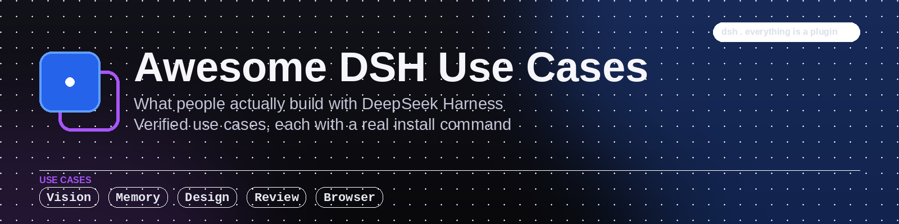

<p align="center">
  
</p>

<p align="center">
  <a href="https://awesome.re"></a>
  
  
  
  
</p>

# Awesome DeepSeek Harness Use Cases

**DeepSeek Harness use cases: 23 things you can actually do with `dsh`, each with a real install command.**

[DeepSeek Harness](https://github.com/deepseek-ai/deepseek-harness) (`dsh`) is DeepSeek AI's open-source
agent harness, built on an architecture where *everything is a plugin*. It shipped on 2026-08-13 and the
plugin ecosystem grew faster than anyone could read it.

This list is not a directory of plugins. It is a directory of **use cases**: "I want my agent to remember
things between sessions", "I want it to read a screenshot", "I want to see what is actually in my context
window". Each one names the project that solves it and the command that installs it.

**Every entry was verified on 2026-08-17.** Each one has a real, published `dsh plugin add` command that we
read out of the project's own documentation. Plugins tagged for discovery but with no working install path
into `dsh` were left out, however popular they were. See [What we left out](#what-we-left-out).

---

## Contents

- [Start here](#start-here)
- [How to read an entry](#how-to-read-an-entry)
- [See and control your context](#see-and-control-your-context)
- [Give a text-only model eyes](#give-a-text-only-model-eyes)
- [Remember things between sessions](#remember-things-between-sessions)
- [Understand an unfamiliar codebase](#understand-an-unfamiliar-codebase)
- [Coordinate more than one agent](#coordinate-more-than-one-agent)
- [Keep a long-running agent under control](#keep-a-long-running-agent-under-control)
- [Reshape the interface](#reshape-the-interface)
- [Get richer output than plain text](#get-richer-output-than-plain-text)
- [Find and install plugins](#find-and-install-plugins)
- [Domain-specific work](#domain-specific-work)
- [What we left out](#what-we-left-out)
- [Security notice](#security-notice)
- [Contributing](#contributing)

---

## Start here

You need Node.js. Nothing else.

**1. Run it.**

```sh
npx @deepseek-ai/dsh web
```

That serves the Web UI at `http://127.0.0.1:3080`. This is the whole setup step.

**2. Install one plugin.** Almost every entry below follows the same shape:

```sh
dsh plugin --profile web add <package>
```

The `--profile` flag picks which composition the plugin is added to. `web` is the profile behind
`dsh web`, and it is the right answer for most of this list.

**3. Pick the use case that annoys you most today.** If you are not sure, start with
[dsh-context](#see-and-control-your-context): seeing what is actually in your context window explains a
surprising amount of agent behaviour.

> `dsh` is in **developer preview** and states plainly that there will be compatibility-breaking changes.
> Pin versions for anything you depend on.

---

## How to read an entry

```
- **The thing you want to do** with [project](repo) by [author](author-repo). What it does. Stars, license.
  install command
```

Star counts and licenses were pulled from the GitHub API on **2026-08-17**. They are shown so you can weigh
an entry without leaving the page, and they will drift; the link is always authoritative.

---

## See and control your context

The single most useful thing to understand about an agent is what it is actually reading.

- **See what is in your context window, and what got compacted away** with
  [dsh-context](https://github.com/bowenliang123/dsh-context) by
  [bowenliang123](https://github.com/bowenliang123). A Context panel and `/context` command that show how
  the window is composed, how it evolved across turns, and what compaction and pruning removed. 173★, Apache-2.0.
  ```sh
  dsh plugin --profile web add dsh-context
  ```

## Give a text-only model eyes

The DeepSeek models behind `dsh` are text-only. A screenshot, a design mock, or a photo of a whiteboard is
invisible to them by default. These add a vision path, and it is the most active problem area in the ecosystem.

- **Paste a screenshot and ask questions about it** with
  [dsh-vision-toolkit](https://github.com/Anionex/dsh-vision-toolkit) by
  [Anionex](https://github.com/Anionex). Intent-aware image question answering, long-screenshot OCR, and
  reproducing a UI from a picture of it. Paste an image into DSH Web and the text-only route switches over
  automatically. 585★, MIT.
  ```sh
  dsh plugin --profile web add @anionex/dsh-vision-toolkit
  ```

- **Read images through a native tool call** with
  [modlens](https://github.com/liustack/modlens) by [liustack](https://github.com/liustack). Exposes a
  `modlens_read_image` tool, so the model requests an image the same way it requests any other tool. The
  version is pinned rather than `@latest` on purpose, which their docs explain. 2,648★, MIT.
  ```sh
  npx -y @deepseek-ai/dsh plugin --profile web add @liustack/modlens@3.18.1
  ```

- **Get vision without signing up for anything** with
  [dsh-vision-router](https://github.com/ysr666/dsh-vision-router) by
  [ysr666](https://github.com/ysr666). Ships a built-in free vision chain that needs no key, plus
  pixel-level verification, and wires its own composition patch on install. 557★, MIT.
  ```sh
  npx @deepseek-ai/dsh plugin --profile web add dsh-vision-router
  ```

## Remember things between sessions

Out of the box each session starts cold. These three take different approaches, so the right one depends on
whether you want a graph, a timeline, or something that reorganizes itself.

- **Give the agent supervised long-term memory** with
  [mnemon](https://github.com/mnemon-dev/mnemon) by [mnemon-dev](https://github.com/mnemon-dev).
  Graph-based recall where an LLM supervises what is worth keeping, rather than storing every turn. 466★, MIT.
  ```sh
  dsh plugin --profile web add dsh-mnemon
  ```

- **Track how a codebase and your decisions changed over time** with
  [memtrace](https://github.com/syncable-dev/memtrace-public) by
  [syncable-dev](https://github.com/syncable-dev). Structural memory on a bi-temporal graph, so you can ask
  what was true at a point in time rather than only what is true now. 452★, MIT.
  ```sh
  dsh plugin --profile web add github:syncable-dev/dsh-plugin-memtrace
  ```

- **Let memory reorganize itself in the background** with
  [dsh-memory-evolve](https://github.com/csyangwen/dsh-memory-evolve) by
  [csyangwen](https://github.com/csyangwen). Cross-session memory on five tracks with git-branch awareness,
  plus a background pass that consolidates rather than only appending. 142★, MIT.
  ```sh
  dsh plugin --profile web add github:csyangwen/dsh-memory-evolve
  ```

## Understand an unfamiliar codebase

- **Generate architecture and sequence diagrams you can check** with
  [archify](https://github.com/tt-a1i/archify) by [tt-a1i](https://github.com/tt-a1i). Architecture,
  workflow, sequence, data-flow and lifecycle diagrams, generated with verification rather than from
  the model's impression of the repo. Community integration, not an official DeepSeek product. 13,702★, MIT.
  ```sh
  dsh plugin --profile web add @tt-a1i/archify-dsh@0.1.0
  ```

## Coordinate more than one agent

- **Run a team of agents with defined roles** with
  [dsh-agent-teams](https://github.com/NanmiCoder/dsh-agent-teams) by
  [NanmiCoder](https://github.com/NanmiCoder). Splits work across a team inside one harness instead of
  running several disconnected sessions. 468★, MIT.
  ```sh
  dsh plugin --profile web add @nanmicoder/dsh-agent-teams
  ```

- **Stay in the loop while agents work** with
  [agentrq](https://github.com/agentrq/agentrq) by [agentrq](https://github.com/agentrq). A self-hosted,
  realtime conversational task manager: the agent asks, you answer, work continues, and you keep a record
  of what was decided. 1,076★, Apache-2.0.
  ```sh
  npx @deepseek-ai/dsh plugin --profile agentrq-<workspace> add @agentrq/dsh-plugin-agentrq
  ```

## Keep a long-running agent under control

- **Run agents in sandboxed, audited sessions** with
  [sandbase-harness](https://github.com/sandbaseai/sandbase-harness) by
  [sandbaseai](https://github.com/sandbaseai). A managed-agent runtime with sandboxed sessions, an audit
  trail, and MCP tools, for when an agent runs longer than you want to watch it. 612★, Apache-2.0.
  ```sh
  dsh plugin --profile web add managed-agents
  ```

## Reshape the interface

`dsh web` is deliberately plain. Most people change it within a day.

- **Add a task board, a git graph, and a working right panel** with
  [dsh-web-ui](https://github.com/zhu1090093659/dsh-web-ui) by
  [zhu1090093659](https://github.com/zhu1090093659). The largest UI collection in the ecosystem: task board,
  git graph, right side panel, mobile pairing for driving a running workspace from your phone. 3,892★, Apache-2.0.
  ```sh
  dsh plugin --profile web add @linxin666/dsh-web-ui-all
  ```

- **Put a file editor, terminal, git view and subagent pages in the sidebar** with
  [DSH-better-sidebar](https://github.com/omdsh-dev/DSH-better-sidebar) by
  [omdsh-dev](https://github.com/omdsh-dev). An open sidebar base that third-party plugins can register new
  pages into, so the sidebar becomes an extension point rather than a fixed menu. 1,857★, MIT.
  ```sh
  dsh plugin --profile web add dsh-better-sidebar@latest
  ```

- **Reference a file by typing `@`** with
  [dsh-at-file](https://github.com/omdsh-dev/dsh-at-file) by [omdsh-dev](https://github.com/omdsh-dev).
  Workspace file search and `@file` mentions, so you stop pasting paths by hand. 311★, MIT.
  ```sh
  dsh plugin --profile web add https://github.com/omdsh-dev/dsh-at-file/archive/refs/tags/v0.6.2.tar.gz
  ```

- **Work in the terminal instead of a browser** with
  [dsh-TUI](https://github.com/ccch1mneyyy/dsh-TUI) by [ccch1mneyyy](https://github.com/ccch1mneyyy).
  A terminal interface with a live status bar, streaming reasoning, double-Escape rollback, and context
  progress with tokens per second. 1,746★, MIT.
  ```sh
  npm install -g @deepseek-ai/dsh @deepseek-harness-tui/dsh-tui
  ```

- **Run it as a desktop app** with
  [deepseek-harness-desktop](https://github.com/anywhere-labs/deepseek-harness-desktop) by
  [anywhere-labs](https://github.com/anywhere-labs). A desktop shell for the DSH plugin ecosystem, with
  signed installers and published SHA-256 digests on each release. 10,886★, MIT.
  Download from [Releases](https://github.com/anywhere-labs/deepseek-harness-desktop/releases/latest).

## Get richer output than plain text

- **Get interactive UI components inline in the conversation** with
  [dsh-genui](https://github.com/omdsh-dev/dsh-genui) by [omdsh-dev](https://github.com/omdsh-dev).
  The model renders real interactive components in the chat instead of describing them. 165★, MIT.
  ```sh
  dsh plugin --profile web add git+https://github.com/omdsh-dev/dsh-genui.git
  ```

- **Turn an answer into an interactive visualization** with
  [dsh-visualize](https://github.com/Nagi-ovo/dsh-visualize) by [Nagi-ovo](https://github.com/Nagi-ovo).
  Renders model-generated interactive cards inside the conversation, useful when the answer is a shape
  rather than a sentence. 165★, MIT.
  ```sh
  dsh plugin --profile web add github:Nagi-ovo/dsh-visualize
  ```

## Find and install plugins

- **Browse and install plugins without leaving the app** with
  [dsh-market](https://github.com/dsh-market/dsh-market) by [dsh-market](https://github.com/dsh-market).
  A plugin market inside DSH: browse, search and one-click install across 800+ plugins. After installing,
  restart `dsh web` and open Settings, then Plugin Market. 764★, MIT.
  ```sh
  dsh plugin --profile web add dshmarket
  ```

- **Read a curated index of the plugin ecosystem** with
  [awesome-dsh-plugin](https://github.com/awesome-dsh-plugin/awesome-dsh-plugin) by the
  [awesome-dsh-plugin](https://github.com/awesome-dsh-plugin) maintainers. The largest curated plugin list,
  bilingual. It answers "which plugin", where this list answers "which use case". 7,008★.
  Browse at [the repo](https://github.com/awesome-dsh-plugin/awesome-dsh-plugin).

## Domain-specific work

- **Get expert guidance for HarmonyOS NEXT development** with
  [harmony-next.skills](https://github.com/linhay/harmony-next.skills) by
  [linhay](https://github.com/linhay). Skills covering HarmonyOS NEXT (API 12+): IDE workflow, language and
  platform specifics, packaged for an agent rather than as documentation to read. 325★, MIT.
  ```sh
  dsh plugin --profile demo add github:linhay/harmony-next.skills
  ```

- **Write long fiction with structure that survives** with
  [AI-Novel-Writer](https://github.com/EthanYoQ/AI-Novel-Writer) by
  [EthanYoQ](https://github.com/EthanYoQ). A local-first writing workbench with characters, outlines and
  chapter state kept consistent across a long project. Desktop builds plus a DSH plugin in developer
  preview. 373★, MIT.
  ```sh
  dsh plugin --profile web add .
  ```

- **Keep notes the agent can use** with
  [notes](https://github.com/zhaoolee/notes) by [zhaoolee](https://github.com/zhaoolee). A self-hosted
  notes app with one-command container deployment, multi-tenant support, and skill calls, so notes are a
  place the agent reads and writes rather than a separate silo. 144★, MIT.
  ```sh
  dsh plugin --profile web add @zhaoolee/dsh-notes
  ```

---

## What we left out

This matters more than what is in, because `dsh-plugin` is currently one of the hottest topics on GitHub and
the tag is doing a lot of work it was not designed for.

We scanned the top 100 repositories carrying the `dsh-plugin` topic. **Only 22 of them publish a working
`dsh plugin add` command.** The rest are a mix of excellent general-purpose agent tools that have no DSH
install path yet, and projects that added the topic for visibility.

Some of the most-starred repositories under that topic are not in this list for exactly that reason. That is
not a judgement on their quality: several are outstanding, and the moment one ships a real DSH install path,
it belongs here. Please open a pull request when that happens.

We would rather ship 23 entries you can actually run than 60 you cannot.

---

## Security notice

These entries are **curated, not audited**. A plugin runs with the permissions of your harness: it can read
your workspace, and some deliberately reach your terminal, your files, or a logged-in browser session.

- Read what a plugin does before installing it, especially anything touching credentials or a browser profile.
- Pin versions. `dsh` is in developer preview and states that breaking changes will happen.
- Memory plugins persist your conversations to disk. Know where, before you point one at a work project.
- Prefer plugins that publish a version and a changelog over ones that only offer a moving tag.

## Contributing

Pull requests are welcome, and the bar is deliberately simple: the entry has to describe **something a
person wants to do**, and it has to install. See [CONTRIBUTING.md](CONTRIBUTING.md) for the format and the
four acceptance rules.

The fastest way to get merged is to name the use case in plain language. "Sync notes into the agent" is an
entry. "A plugin for notes" is a plugin list, which is [already covered elsewhere](https://github.com/awesome-dsh-plugin/awesome-dsh-plugin)
and done well.

---

<p align="center">
  <sub>
    Maintained by <a href="https://github.com/therohitdas">therohitdas</a>.
    Counts verified against the GitHub API on 2026-08-17.
    <br />
    Built with <a href="https://crhq.ai">crhq.ai</a>.
  </sub>
</p>
